# My Voting-APP

A website which allows users to vote given multiple choices
## Technology Used
Backend - For Backend I used Django

Frontend - For Frontend I used Bootstrap

--------


## Features of the APP(User side)

- User will be able to Register/Login
- User will have a Choice for the Title he wants to vote to
- User will have options of Candidates to vote for
- Will see the result screen after he completes Voting

## Features of the APP(Admin side)

- Admin can login to Django Administration and 
- Can See No of Users Registered
- Can Add Users and Remove Users
- Can Add Candidates and Positions for Voting
- Can Check The No of Votes Each Candidate has Received.
-  The Voting Data is also sent to Firebase RealTime Database, where the 'Live no of Votes', 'Candidate' and 'Title' is stored for each Vote received from the User under the node "votes".


##  How I did this Project
This was my first project in Web Developement, 
Always wanted to start learning django and this was a great oppurtunity.
I devoted a significant portion of my time to working on the backend (Django) side of the project.
- To begin with, I started by creating simple HTML templates and spent a lot of time learning about Django, referring to multiple projects related to Django

- I focused on implementing features such as login forms, registration forms, retrieving data, and authenticating in Django.

- I spent the majority of my time learning how to add restrictions, such as allowing users to vote only once for a title, displaying a warning message for wrong usernames and passwords during authentication.

- Once I had completed the basic requirements, I started learning about how to connect the Firebase Realtime Database to my project.

- I spent some time working on this and managed to connect the database to receive the number of votes received, the candidate, and the title in real-time.

- Only after I had completed the backend, did I begin working on the frontend part of the project. I went through some Bootstrap tutorials and created some decent-looking web pages, using what I had learned.


## Flow of the Web-APP(From the User Side)

- User Goes to our website
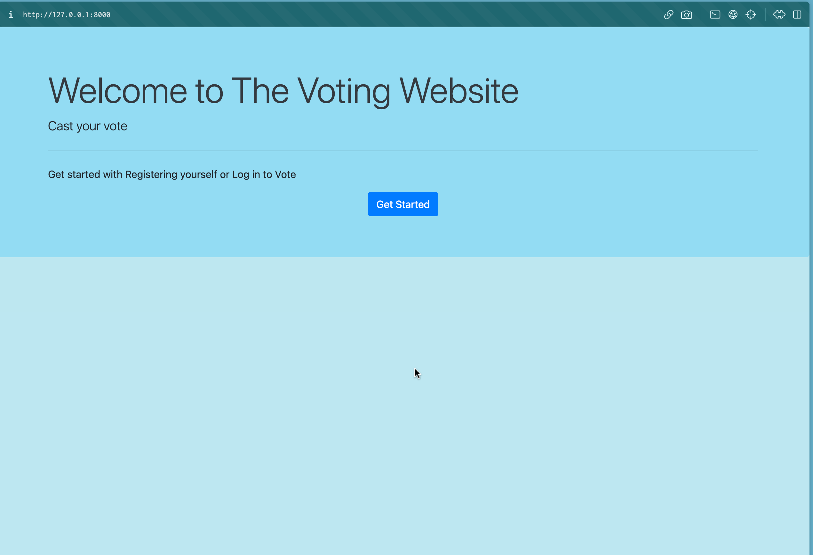

- Gets to the Registration Page
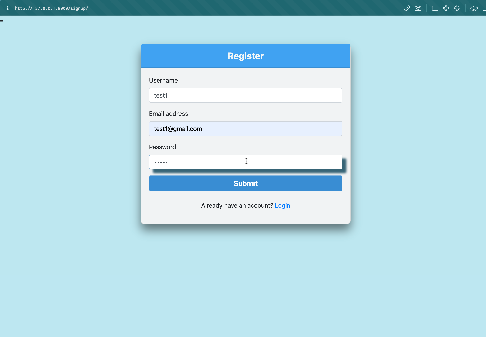

- After Registration, Redirects to Login Page
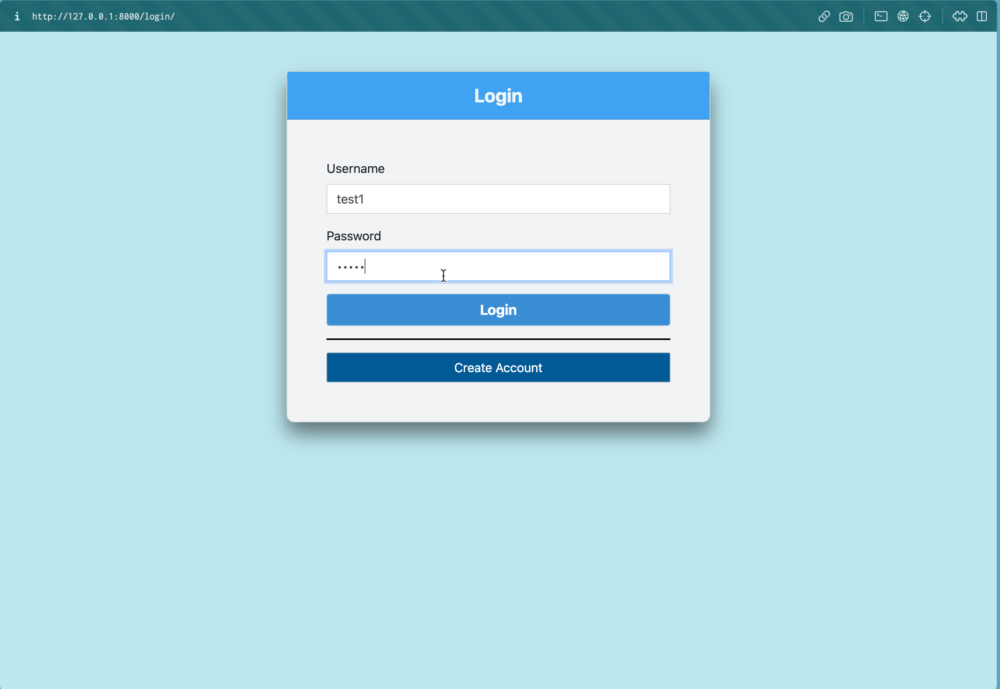

- After Login Goes to our HomePage
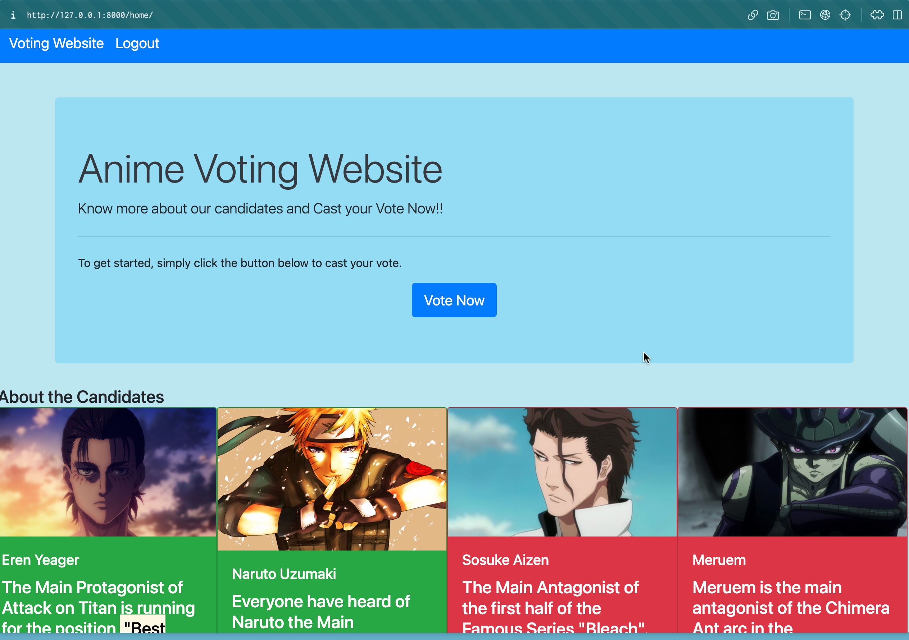

- After Clicking Votenow, Sees the Positions Available
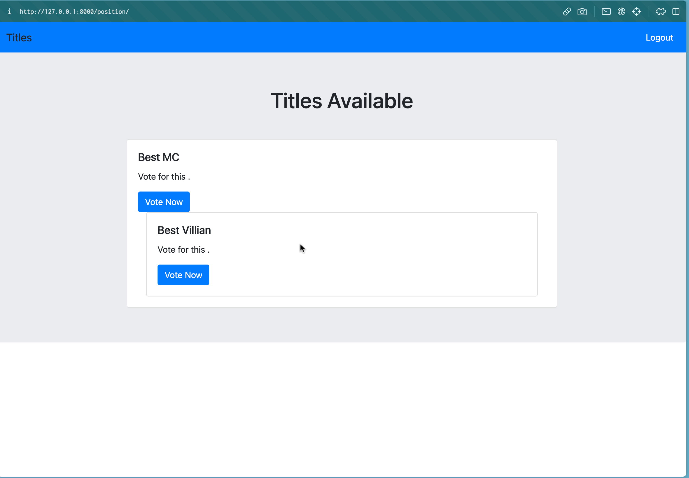

- After Selecting a Position, Goes to the Voting Page
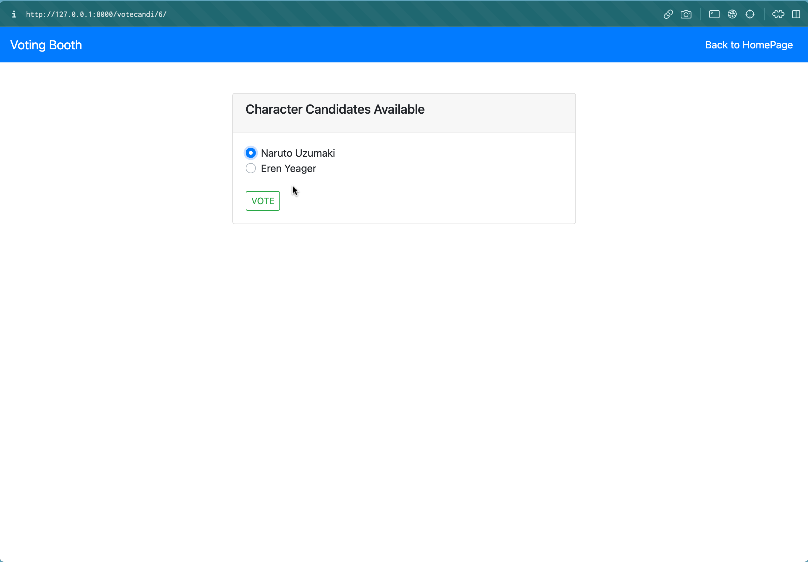

- After Voting(wait for a few seconds for the data to be sent to firebase) Redirects to the Result Page
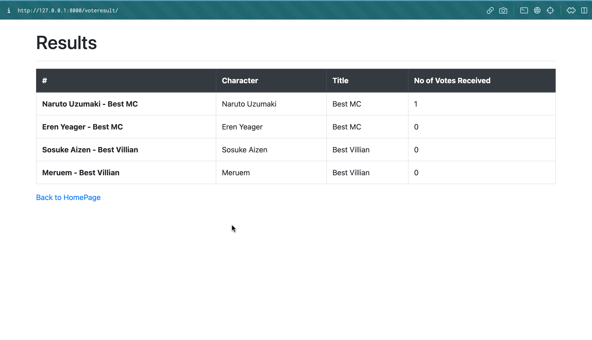


## Flow of the Web-APP(From the Admin Side)

- Admin can see all the users who have Registered
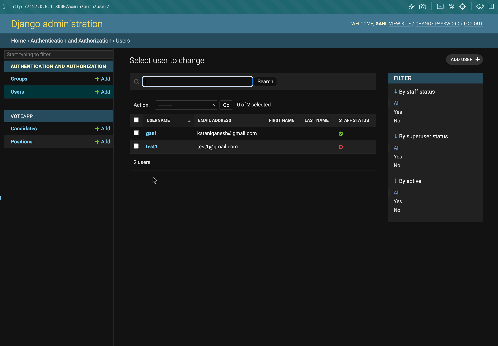

- Admin Can see the No of Candidates and Positions Available and can add or delete them
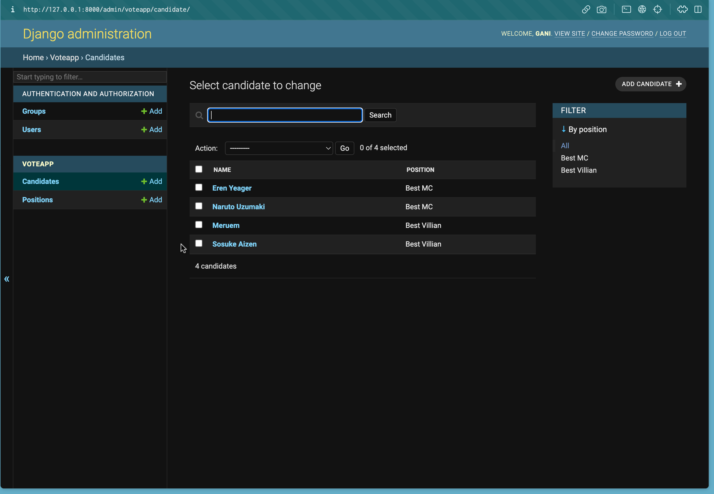
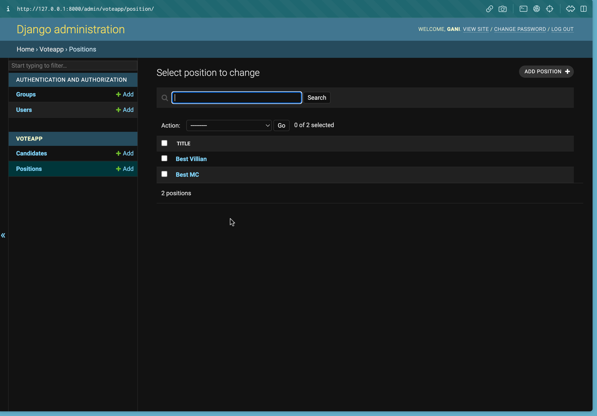

- Admin can see the number of votes received by a Candidate
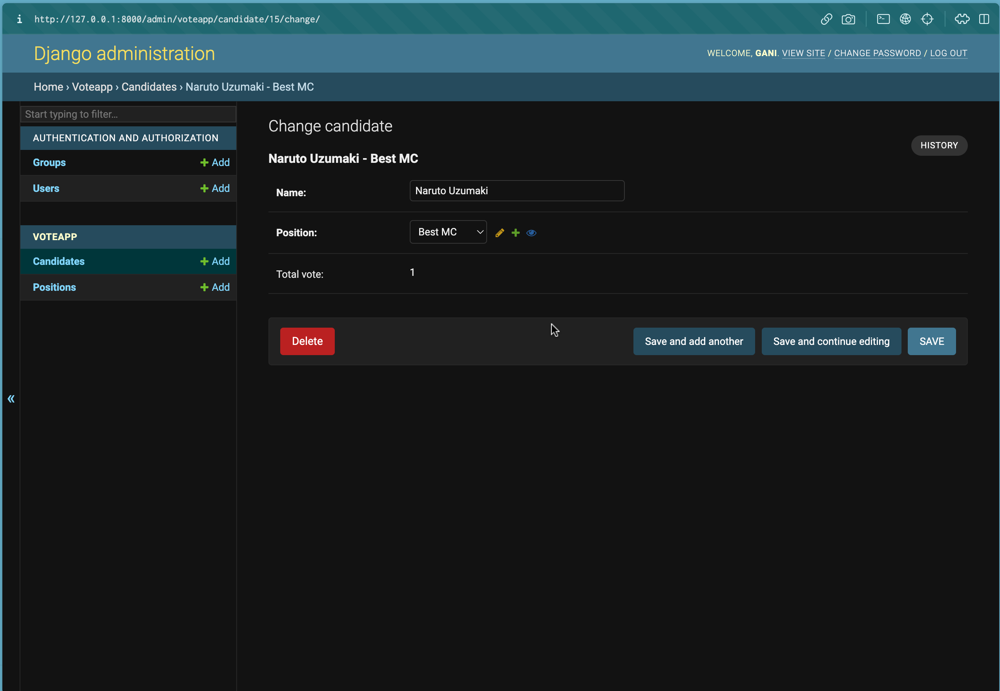

- Admin can see the live update in the Firebase Realtime database
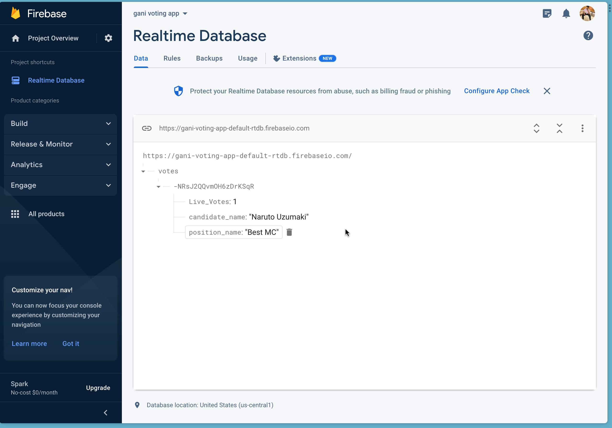

## How to Run the Project
- After cloning the repo, go to the virtual env where django is installed 
and run the command
```
python3 manage.py runserver

```
and go to the server given in the terminal
**after selecting a candidate and vote is clicked one time in the voting page, wait for a few seconds for the results page to load, as it takes a few seconds for the data to be sent to firebase**

## 🔗 Resources I used
- https://www.youtube.com/watch?v=rHux0gMZ3Eg
- https://www.youtube.com/watch?v=jBzwzrDvZ18 (Select Parts of this Video)
- https://docs.djangoproject.com/en/4.1/ref/contrib/admin/
- https://www.section.io/engineering-education/integrating-firebase-database-in-django/
- https://www.youtube.com/watch?v=-IVtds5ufLY
- https://getbootstrap.com/docs/5.0/getting-started/introduction/
- https://www.youtube.com/watch?v=-qfEOE4vtxE (someparts of this)
----
* There were other small issues for which i Googled  as well.

## Problems
- Was Not able to Host the webapp, tried many things like pythonanywhere and railway,
- So i Created a new repo (https://github.com/Gani-24/myVoting) and uploaded all the same files and removed the Firebase Functionality, and was able to host the app.
- for the firebase functionality to work, have to clone this repo and run it locally


